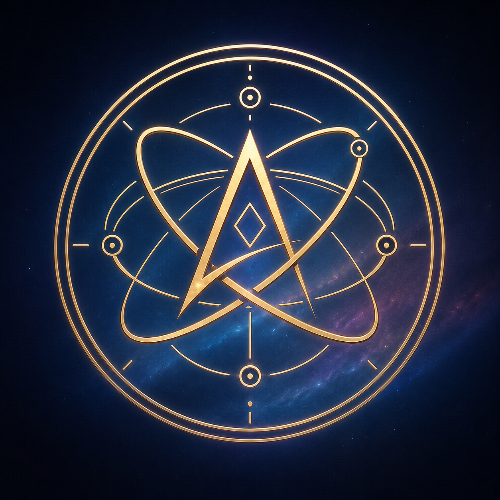

  

شعار "مدارات الحقيقة"

شعار الذرة المفتوحة هو رمز صُمم للتعبير عن الإلحاد واللادينية والعقلانية الحديثة من خلال دمج عدة رموز في شكل واحد.

حرف A

يقع حرف A في مركز الشعار، وهو الحرف الأول من كلمة Atheism (الإلحاد). يمثل هذا الحرف الفكرة الأساسية للشعار، وهي عدم تبني المعتقدات الدينية بوصفها حقائق مؤكدة دون دليل كافٍ.

الذرة والمدارات

تحيط بالحرف مجموعة من المدارات المستوحاة من النماذج الذرية الكلاسيكية. لا ترمز هذه المدارات إلى العلم وحده، بل إلى فكرة أن فهم الكون يتم من خلال الملاحظة والتجربة والبحث المستمر، وأن المعرفة الإنسانية تتطور مع ظهور أدلة جديدة.

كما تمثل المدارات حركة الأفكار والأسئلة التي لا تتوقف، وترمز إلى أن الحقيقة ليست شيئًا يُفترض امتلاكه مسبقًا، بل شيء يُسعى إليه باستمرار.

الماسة المركزية

تقع ماسة في قلب الشعار، وتمثل الحقيقة بوصفها الهدف النهائي للبحث الفكري. اختير شكل الماسة لأنها تتكون تحت ضغط طويل وتتميز بالصلابة والوضوح، في إشارة إلى أن الوصول إلى المعرفة يتطلب النقد والاختبار والصبر.

كما ترمز الماسة إلى أن الحقيقة لا تنتمي إلى عقيدة أو جماعة محددة، بل تبقى هدفًا مفتوحًا أمام جميع البشر.

الدائرة الخارجية

تشكل الحلقة الخارجية إطارًا يوحد جميع عناصر الشعار. وترمز إلى الكون الواحد الذي يشترك فيه جميع البشر بغض النظر عن معتقداتهم أو ثقافاتهم أو خلفياتهم الفكرية.

الفكرة العامة

يهدف الشعار إلى تمثيل الأشخاص الذين يفضلون الاعتماد على العقل والأدلة في تكوين قناعاتهم، ويرون أن جميع الأفكار، بما فيها أفكارهم الخاصة، يجب أن تبقى قابلة للمراجعة والنقد.

لا يدعي الشعار تمثيل جميع الملحدين أو اللادينيين، بل يقدم تصورًا رمزيًا لقيم مثل حرية التفكير، والشك المنهجي، والبحث عن الحقيقة، والانفتاح على المعرفة الجديدة.

Open Atom Symbol — Created by Kai

#الاحاد #إلحاد  #لادينيون #ملحد #ملحدون

شعار الذرة المفتوحة هو رمز صُمم للتعبير عن الإلحاد واللادينية والعقلانية الحديثة...
